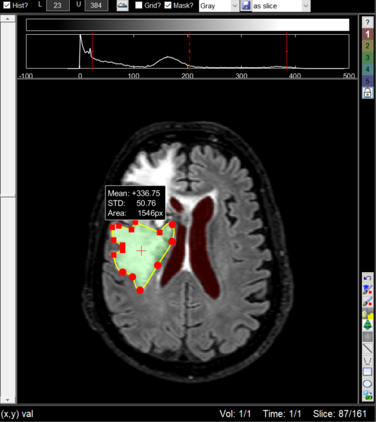

# imtool3D
This is an image viewer designed to view a 3D stack of image slices. For example, if you load into matlab a DICOM series of CT or MRI images, you can visualize the images easily using this tool. It lets you scroll through slices, adjust the window and level, make ROI measurements, and export images into standard image formats (e.g., .png, .jpg, or .tif) or the 3D mask as NIFTI file (.nii). Use imtool3D_nii to load NIFTI files.
This tool is written using the object-oriented features of matlab. This means that you can treat the tool like any graphics object and it can easily be embedded into any figure. So if you're designing a GUI in which you need the user to visualize and scroll through image slices, you don't need to write all the code for that! Its already done in this tool! Just create an imtool3D object and put it in your GUI figure.

<p align="center">
  
</p>
  
imtool3D is used heavily by several other projects:
* [qMRLab](https://github.com/qMRLab/qMRLab)
* [imquest](https://gitlab.oit.duke.edu/railabs/SameiResearchGroup/imquest)
* [lesionTool](https://gitlab.oit.duke.edu/railabs/SameiResearchGroup/lesionTool)

# Dependencies
* Matlab's image processing toolbox (ROI tools are disabled otherwise)
* [dicm2nii](https://github.com/xiangruili/dicm2nii) (if NIFTI images are used)

# Tuto
## include in a GUI
````matlab
% Add viewer in a panel in the middle of the GUI
GUI = figure;
tool = imtool3D([],[.1 .1 .8 .8],GUI)

% set MRI image
load mri % example mri image provided by MATLAB
D = squeeze(D);
D = permute(D(end:-1:1,:,:),[2 1 3]); % LPI orientation
tool.setImage(D)
tool.setAspectRatio([1 1 2.5]) % set voxel size to 1mm x 1mm x 2.5mm

````

# what is new in this fork? 
* Support for 5D volumes (scroll through time and volumeS with arrows)
* Keyboard shortcut
* Multi-label mask
* Save mask
* NIFTI files (.nii) support (double click on a. nii file in Matlab filebrowser) 
* New tools for mask (interpolate slices, active contour...)
* Convert Mask2poly and poly2mask
* splines in polygons (double click a circle)
* 3 planes view

# Authors
Justin Solomon (Original release)  
Tanguy Duval (4D (time) and 5D (different contrast); multi-label mask; active_contour, undo button, mask2poly, poly2mask, shortcuts)  

# Original release
https://fr.mathworks.com/matlabcentral/fileexchange/40753-imtool3d
