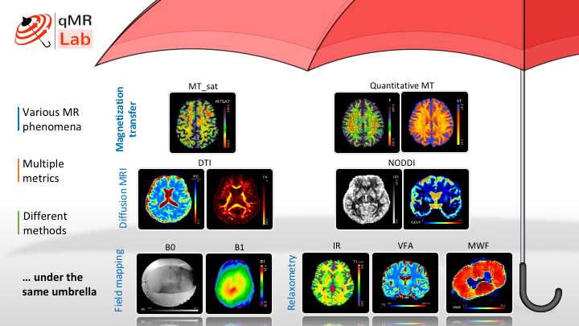

# 

Welcome to qMRLab, all your quantitative MRI needs under one umbrella! 

qMRLab is an open-source software for quantitative MR image analysis. The main goal
is to provide the community with an intuitive tool for data fitting, plotting, simulation and protocol optimization for a myriad of different quantitative models.
The modularity of the implementation makes it easy to add any additional modules and we encourage everyone to contribute their favorite recipe for qMR!

qMRLab is a fork from the initial project ['qMTLab'](https://github.com/neuropoly/qMTLab).  

For **documentation**, visit the ['Documentation website'](http://qmrlab.readthedocs.io/)
If you are a developer, visit the ['Wiki page'](https://github.com/neuropoly/qMRLab/wiki) 

Please report any bug or suggestions in [github](https://github.com/neuropoly/qMRLab/issues).
    

## Citation

If you use qMRLab in you work, please cite:

Cabana, J.-F., Gu, Y., Boudreau, M., Levesque, I. R., Atchia, Y., Sled, J. G., Narayanan, S., Arnold, D. L., Pike, G. B., Cohen-Adad, J., Duval, T., Vuong, M.-T. and Stikov, N. (2016), Quantitative magnetization transfer imaging made easy with qMTLab: Software for data simulation, analysis, and visualization. Concepts Magn. Reson.. doi: 10.1002/cmr.a.21357

