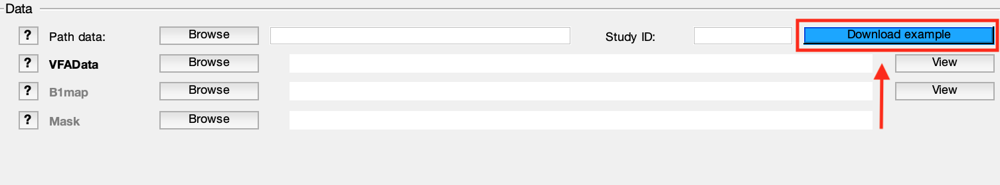

Example datasets
=========================================

.. figure:: https://www.library.ucla.edu/sites/default/files/media/osf-logo-black.original.png
   :scale: 30%
   :width: 400px

Every qMRLab model comes with an example dataset stored in our `public OSF repository <https://osf.io/tmdfu/>`_.
These datasets can be directly downloaded from the OSF, or using qMRLab's 
interfaces.

Download example datasets via GUI
------------------------------------

After selecting a model from the dropdown menu, you can use *Download Data* (blue) button located at the upper right corner of the data panel to download the respective dataset:

You will be prompted for a directory where the example dataset will be saved. After the dataset has been downloaded, qMRLab will 
automatically set *Path data* to the download directory and load the input files.

.. note::
   **Please note that** such auto-loading takes effect only if the name of the images (e.g. VFAData.nii.gz) in the Path data directory are identical to that of the data fields (e.g., VFAData) listed in the data panel. There are no filename assumptions for the user data. Any file name is acceptable as long as the data format and the data dimensions are in agreement with the method's inputs. 

.. warning::
   **The default `Protocol` parameters are intended for the example datasets.** Users are required to update these values with regards to their data. 

Step by step instructions to get started with GUI are available at :ref:`Beginner's example with GUI`.

Download example datasets via CLI
------------------------------------

qMRlab can automatically generate an m-script (`model_name_batch.m`) or a Jupyter Notebook (`model_name_batch.ipynb`)for every model and download corresponding datasets for fitting by `qMRGenBatch` and `qMRGenJNB` functions, respectively.

Step by step instructions to get started with CLI are available at :ref:`Beginner's example with CLI`.

Note: You can execute Jupyter Notebooks online by clicking the Binder badge located at the top of the respective method's `documentation <qmrlab.readthedocs.io/en/master/>`_. page. See an example for `variable flip angle T1 mapping <https://mybinder.org/v2/gh/qMRLab/doc_notebooks/master?filepath=vfa_t1_notebook.ipynb>`_.

If you would like to download the example dataset without generating scripts ::

  Model = model_name;
  path = 'directory/to/download/the/data/';
  downloadData(Model, path);

