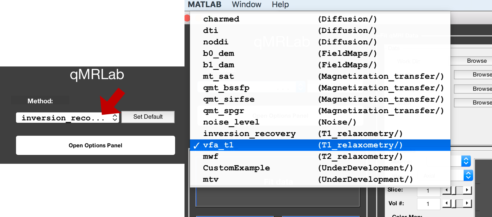
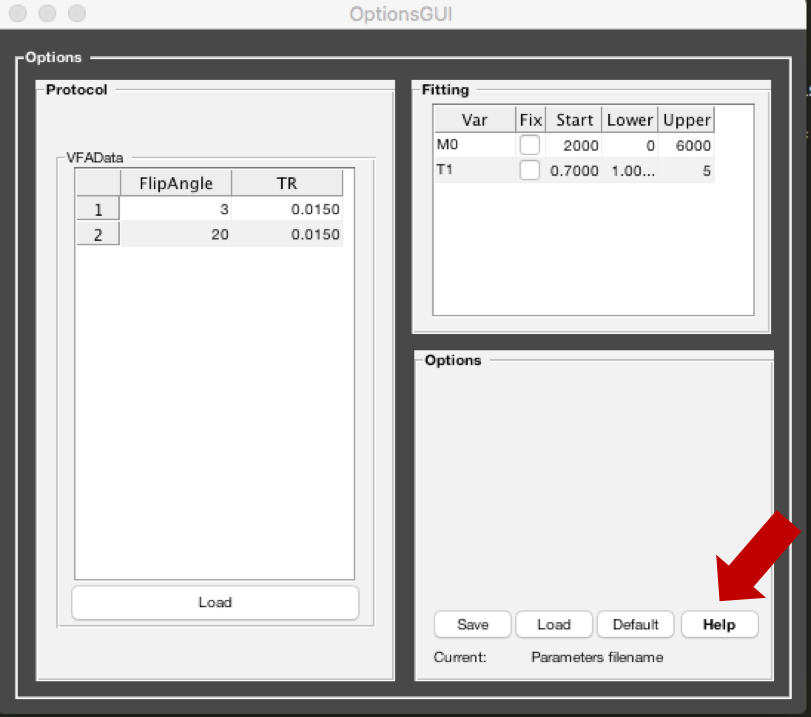
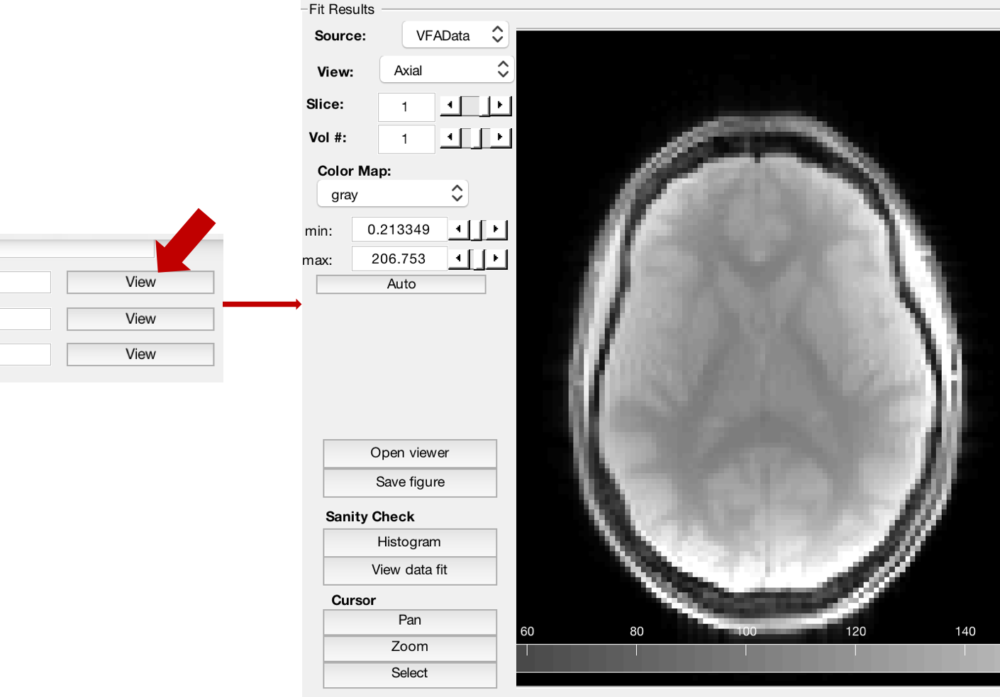
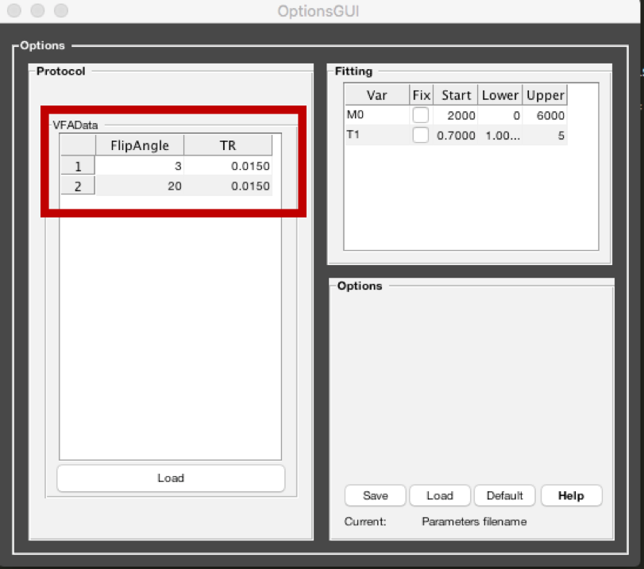
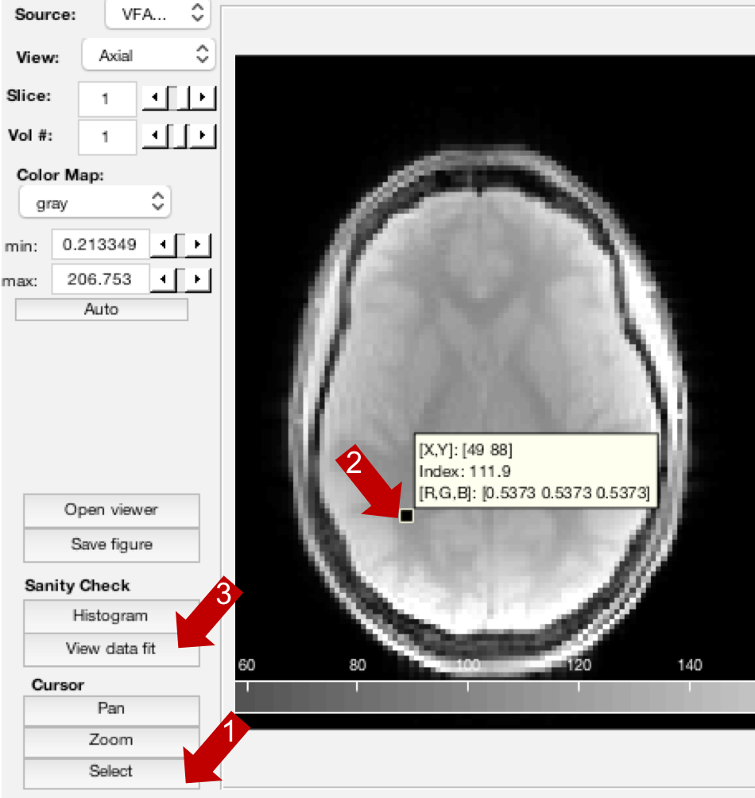
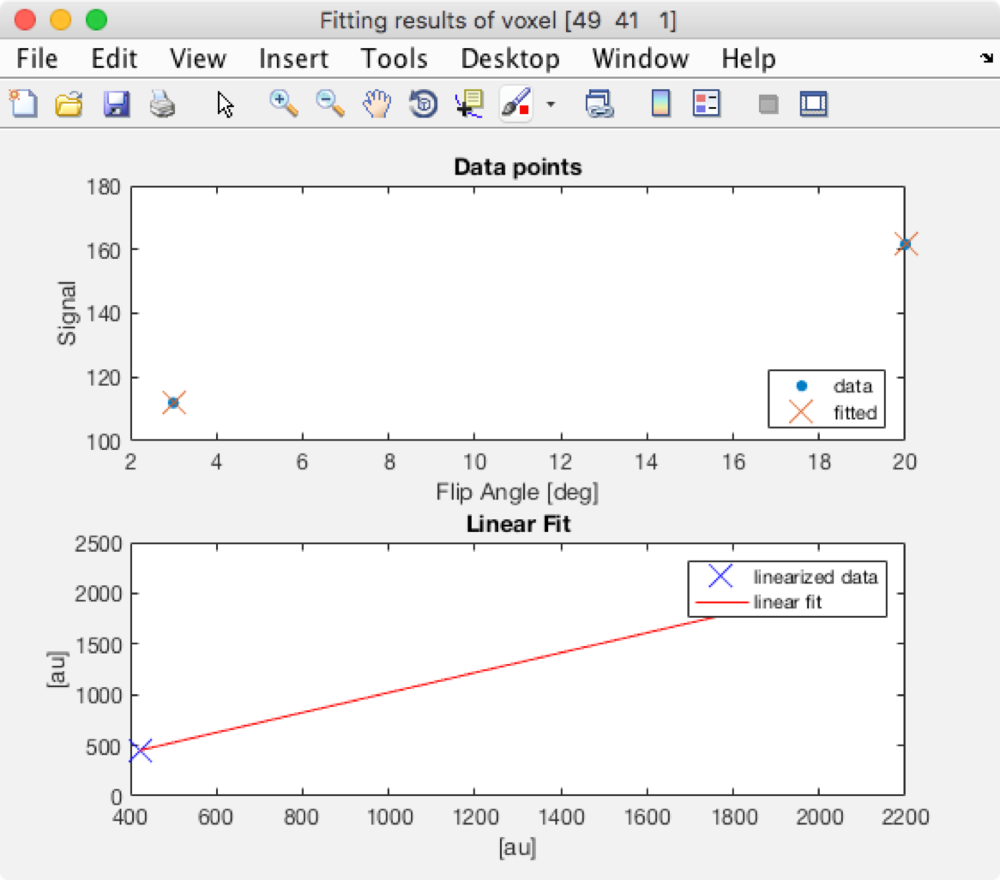
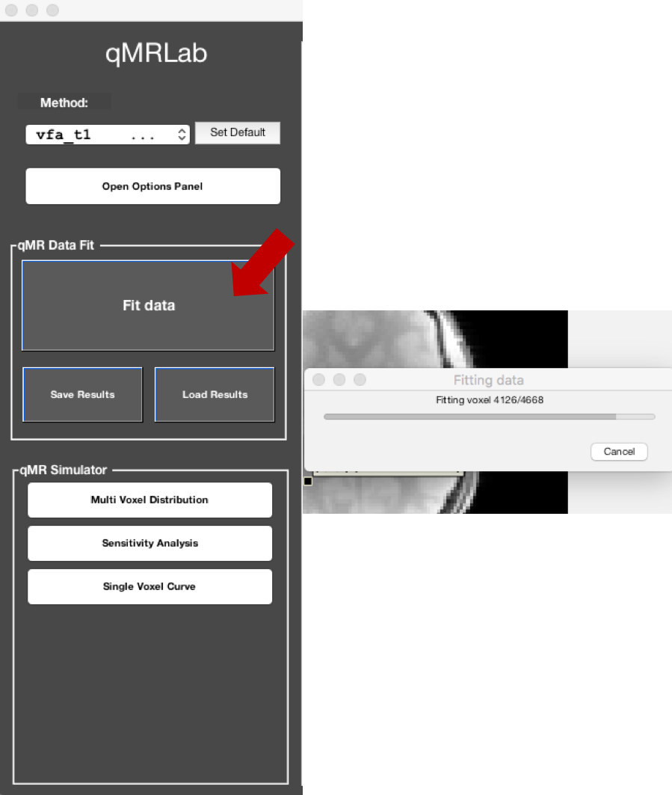
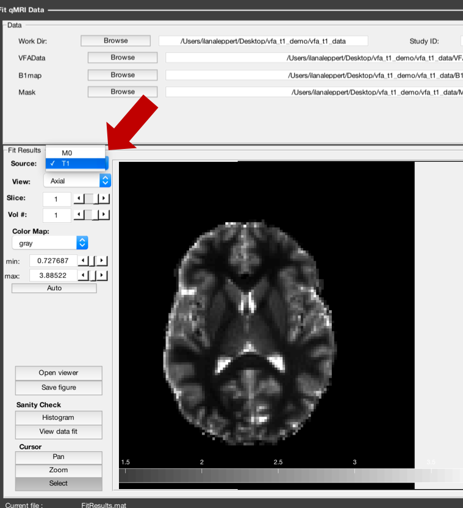

Beginner's example with GUI
=========================================
This will guide you step by step in processing a sample dataset with the user interface.

1. Open matlab
----------------------------------

2. Run startup
----------------------------------
Go to qMRLab installation folder (note: replace "PATH_QMRLAB" with the actual path) ::

	cd PATH_QMRLAB

Setup your path (note: you only need to do it once) ::

	startup

3. Launch the GUI
-----------------------------
Type this is matlab to launch the main GUI::

	qMRLab

4. Model selection
-------------------------
On the top left-hand side pull-down menu, select the method we are going to use, in this case, *vfa_t1        (T1_relaxometry/)* :

At any time, you may use the *Help* button in the *Options* panel to get a description of the model:

For the list of available models, please check :ref:`Methods available`

5. Download example data
------------------------------
In this case we will be working with Variable Flip Angle Data to compute a T1map. The main input data is stored as a 4D volume, where the 4th dimension is different flip angles. 
For example, in this test dataset, 1 slice at 2 different flip angles were acquired: volume 1 was FA=3degrees and volumes 2 was FA=20degrees, such that *VFAData.nii.gz* is 128x128x1x2. The other optional inputs are a *Mask.nii.gz* and a *B1Map.nii.gz*.

Click *Download Data* (blue) button located at the upper right corner of the data panel:

.. figure:: _static/gui_download.png
   :width: 800px
   :height: 158px

You will be prompted for a directory where the example dataset will be saved. After the dataset has been downloaded, qMRLab will 
automatically set *Path data* to the download directory and load the input files.

.. note::
   **Please note that** such auto-loading takes effect only if the name of the images (e.g. VFAData.nii.gz) in the Path data directory are identical to that of the data fields (e.g., VFAData) listed in the data panel. There are no filename assumptions for the user data. Any file name is acceptable as long as the data format and the data dimensions are in agreement with the method's inputs. 

.. warning::
   **The default `Protocol` parameters are intended for the example datasets.** Users are required to update these values with regards to their data. 

For a more detailed description about input data formats, please refer to :ref:`4.1	Data format`

6. View the data
-------------------------
You can look at your data by clicking *View* next to the name of the file:

You can browse through slices or volumes of the data files by using arrows and mouse controls.  
Please refer to :ref:`3.	Data Viewer`.

7. Set up the protocol
------------------------
For this dataset, the protocol will be set up by default with the flip angles and TRs: 

For your own acquisition, you will have to use an external txt file to load the parameters, please refer to :ref:`6.1 Protocol`. 

8. View the data fit in 1 voxel
-----------------------------------

Before fitting the whole volume, it's a good idea to take a look at your data and how it fits the model. Here, we can visualize the fit in 1 voxel at a time. In the *Cursor* section, press *Select*. Then select a voxel in the image and the press *View data fit*:

A new window will pop-up with the results of the fit in that voxel:

9. Fit the whole dataset
---------------------------
We can now fit the whole volume by pressing the large *Fit Data* button.

A wait bar will appear while the data is being processed and will automatically when done. From the pull-down menu to the left of the image, it's possible to select the output you would like to view. For example, the T1map:

For more information and to explore other functionality such as the simulations, please visit :ref:`Graphical User Interface Usage`.
