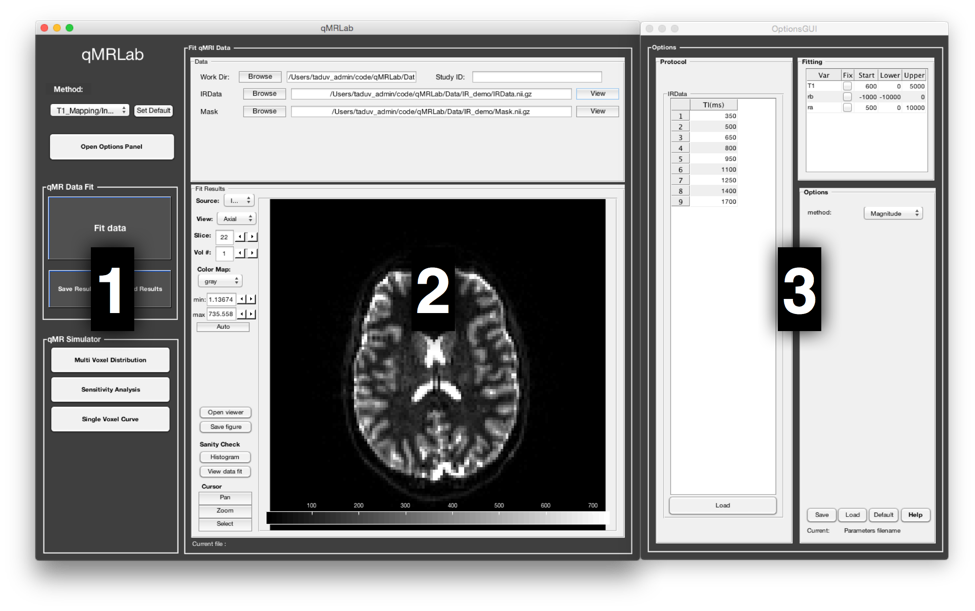
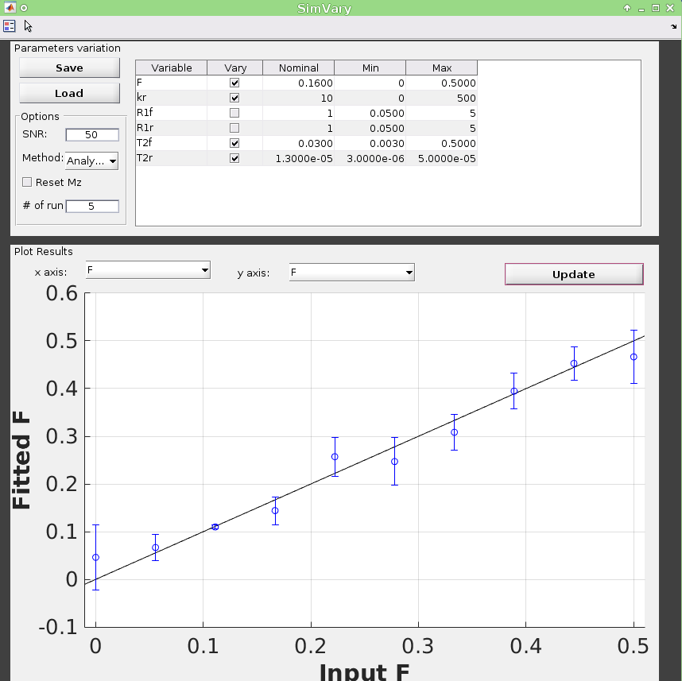
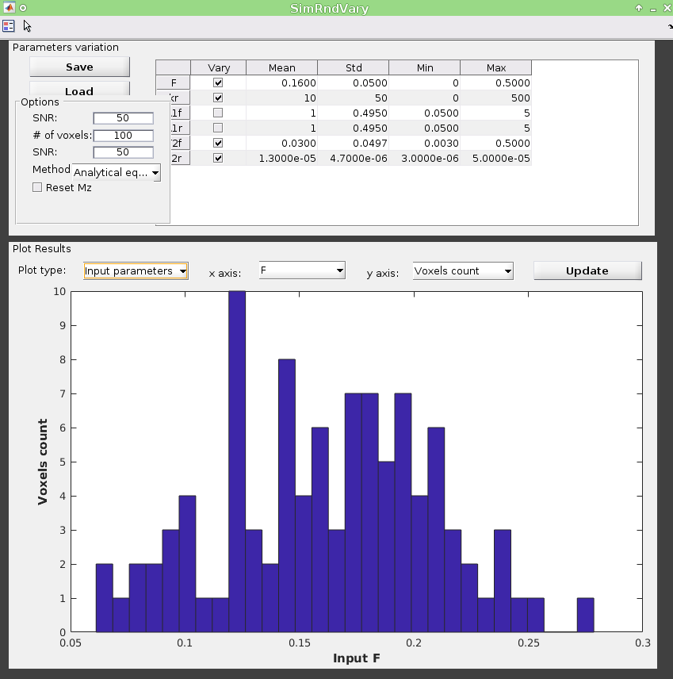
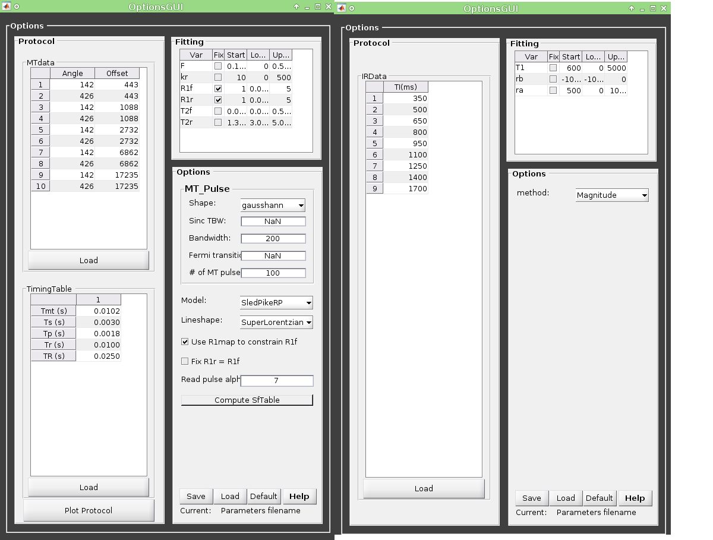

Graphical User Interface (GUI)
======================================
This section describes the various features and functionality of the user interface.

1. Startup
----------------------------------
Launch matlab from the qMRLab folder. Then load the default setup by typing::

    startup

Then open the GUI by typing::

    qMRLab

2. Layout
----------------------------------
When you first launch qMRLab, you will be presented with a blank interface. The interface consists of three columns, or panels. On the left, you have the *Menu* panel, in the center you have the *Main panel*, and on the right, in a separate floating window, you have the *Options* panel.

   Default interface with 3 panels: (1) ``Menu``, (2) ``Main`` and (3) floating ``Options``

2.1 Menu Panel
~~~~~~~~~~~~~~~~~~~~~~~
The ``Menu panel`` is where you can choose the task you want to perform. It is divided in three sections: ``Method``, ``qMR Data Fit`` and ``qMR Data Simulator``.

2.1.1 Method
++++++++++++++++
At the top, you will find a drop-down menu where you can choose the MR acquisition method that you want to be working with. An updated list of the available methods is here: :ref:`Methods available`

Note that the ``Main`` and ``Options`` panels will update to the appropriate window according to your selection.
If you plan to be working mainly with a particular method, select it from the drop-down menu first, and the click on the ``Set Default`` button next to it. Next time you open qMRLab, your preferred method will be selected by default.

Clicking on the ``Open Options Panel`` below the method drop-down menu will open the *Options* panel window and set its position on the right side of the ``Main`` panel. This is useful to bring back the ``Options`` panel window to the front if it’s hidden behind another window, to reset its position if you have resized the windows, or to reopen it in case you closed it.

2.1.2 qMR Data Fit
+++++++++++++++++++++++
Click on the big ``Fit Data`` button only when you have selected your data files, set up your protocol and fitting options and are ready to begin the fitting process, which, depending on the size of your data and the method, can take from a few minutes to a couple of hours. The ``Save Results`` button will prompt you to save a .mat file with the results of your data fit. ``Load Results`` will load previously saved results and display them. Refer to this section :ref:`4.	Data Fitting` for more information.

2.1.3 qMR Data Simulator
++++++++++++++++++++++++++++++++
The buttons of this menu allow you to choose between different data simulation mode. All Methods that involve a data fitting procedure present at least the following simulations: ``Single Voxel Curve``, ``Sensitivity Analysis`` and ``Multi Voxel Distribution``. Clicking on any one of these buttons will bring the corresponding interface in a floating window. When any of these interfaces are opened, clicking on the ``update`` button will launch the simulation using the current options (defined in the ``Options`` panel). The ``Save Results`` button will prompt you to save a .mat file with the current simulation results. ``Load Results`` will load previously saved simulation results and display them in the appropriate panel. Refer to this section :ref:`5.	Simulation` for more information.

Single Voxel Curve
______________________
The ``Single Voxel Curve`` panel is a simple interface to simulate MR data from a single voxel, using the defined MR parameters and protocol. It is the fastest way to evaluate various acquisition protocols, the performance of the model and fitting options. Refer to section :ref:`5.1.	Single Voxel Curve` for more information.

Sensitivity Analysis
_______________________
The ``Sensitivity Analysis`` simulation allows you to systematically vary one MR parameter, over a defined range and number of points, while keeping the others fixed. For each simulated data point, noise is added with a given SNR, and the fit is run multiple times while adding Gaussian noise. This allows you to evaluate the variance of the fit at each point. When the simulation is done, a plot shows any variable input parameters as the independent variable, as well as the mean values and variance of any fitted parameters. Refer to section :ref:`5.2.	Sensitivity Analysis` for more information.

Multi Voxel Distribution
___________________________
The ``Multi Voxel Distribution`` is a tool to simulate any number of voxels, where any parameters combination are allowed to be varied simultaneously. You can choose how many voxels to simulate and which parameters are to be normally distributed, with its mean value and variance. The results can be displayed in a number of ways such as distribution histograms, scatter plots of input vs fitted parameters, error histograms, etc. Refer to section :ref:`5.3. Multi Voxel Distribution` for more information.

2.2 Main Panel
~~~~~~~~~~~~~~~~~~~~~~~
The ``Main`` panel is where you can load your data files for fitting and for viewing the resulting parameters maps. This panel changes correspondingly to the Method selected in the *Menu* panel.

2.3 Options Panel
~~~~~~~~~~~~~~~~~~~~~~~
This is where you can set up all the parameters that are related to the simulation, the fitting and the protocol. The ``Options`` panel is displayed in a separate window than the ``Menu`` panel or ``Main`` panel. This is because each qMR acquisition method has its own particular options, and this window needs to be changed correspondingly. It can also be closed at any time, if it is not currently needed, to provide for a simpler interface. The *Options* panel consists of three sub-panels: ``Protocol``, ``Fitting``, and ``Options``. At the bottom of all these sub-panels you will find buttons to ``Reset`` the changes you made, ``Save`` the current settings as a .mat file, ``Load`` a .mat file of settings, or go back to the ``Default`` settings. Refer to section :ref:`6. Options Panel` for more information.

2.3.1	Protocol
+++++++++++++++++++
Here you define the ``acquisition protocol`` that you wish to use for simulation, or in the case of data fitting, the protocol you used to acquire the data. See :ref:`6.1 Protocol` for more information.

2.3.2	Fitting
+++++++++++++++++++
This is where you set up your ``fitting options``. The fit parameters table lists all the variables that are available for fitting in the current method, a tick box to select which variables are to be held fixed, a starting value and lower/upper bounds. Note that some methods do not have fitting procedures, this table is empty in this case. Depending on the method, additional options may be available. See :ref:`6.2.	Fitting` for more information.

2.3.3 Options
+++++++++++++++++++
This is where you set up all the options related to the simulations. Depending on the qMR method, different sets of options are available (e.g. the fitting procedure, assumptions of the model, etc). More info in :ref:`6.3. Options`.

3.  Data Viewer
----------------------
The viewer allows you to navigate through your (up tp) ``5D`` dataset easily using arrows:

.. figure:: _static/imtool3D/imtool3D_volume.gif
   :scale: 100 %

**Use mouse controls to display your volume:**

:Middle (shift+) Click and drag: Zoom in/out
:Left            Click and drag: Contrast/Brightness
:Right  (ctrl+)  Click and drag: Pan
:Scroll wheel: Change slice 

.. figure:: _static/imtool3D/imtool3D_mouse.gif
   :scale: 100 %

The viewer provides ROI tools to create and modify a multi-label mask that is overlaid on the image.  
The ``Mask`` in the file browser is loaded automatically, you can delete it using right click on the button ``label 1``.  
The mask can be hidden/shown using the checkbox on the top (or use spacebar)... make sure the mask is toggle on when you draw it!  
The mask can have 5 different labels (1-5). Select the label on which you want to operate. One voxel can be attributed only one label (no overlaps between labels). The locker button prevents any modification and overwrite to labels that are not selected.  
ROI tools such as square or polygon can be converted to mask (right click on an ROI object) and conversely (mask2poly button).
Statistics on each label (e.g. volume, mean intensity) can be obtained with mouse over the label number.  

**Brush tool controls:**

:Middle click and drag: Change brush diameter
:Right click: erase
:double click: (smart brush only) Toggle between bright or dark segmentation

.. figure:: _static/imtool3D/imtool3D_roi.gif
   :scale: 100 %

.. figure:: _static/imtool3D/imtool3D_smartbrush.gif
   :scale: 100 %

**Polygon tool controls:**

:Click on a line: add a button
:Double click on a point: toggle between a line and a curve
:Middle click on a point: delete this intermediary point

.. figure:: _static/imtool3D/imtool3D_polygon.gif
   :scale: 100 %

4.	Data Fitting
----------------------
qMRLab provides a convenient interface to fit your  data and visualize the parameters maps. To ensure that the results are successful, you’ll need to define the appropriate protocol, as it was used for data acquisition, and to format your qMR data in the way qMRLab expects it to be.

4.1	Data format
~~~~~~~~~~~~~~~~~~~~~~
Currently supported file types are .mat and .nii files. Your files should respect the following:

* For .mat files, the name of the file can be anything, but the array it contains should be named appropriately. The list of input names is case sensitive and is specified at the top of the ``Data`` dialog box. For example, for a qMT SPGR experiment, ``MTdata`` (for the actual MT data array) or *R1map* / *B1map* / *B0map* / *Mask* respectively for a R1 / B1 / B0 or Mask file.

.. figure:: _static/inputs.png
   :scale: 100 %

   Example of list of inputs for qMT SPGR experiment

*	Each model will expect a different format of inputs, but in general, for single slice (2D) imaging, the main data is a 3D array with size [nx, ny, ndata], where nx/ny is the number of voxels in the x/y direction, and ndata is the number of data points for each voxel. For volume imaging (3D), data is a 4D array with size [nx, ny, nz, ndata], where nx/ny/ndata are as above, and nz is the number of voxels (or slices) in the z direction (e.g. in this example *MTdata* would have several datapoints per voxel).
*	Other files (e.g. in this example *R1map / B1map / B0map / Mask*) are formatted as [nx, ny, nz].

For a more detailed description of the format required for each input, type this in the maltab window::

      help Modelname

where ``Modelname`` is name of the available models (e.g. in this example *help SPGR*). Alternatively, in the ``Options`` panel, you can press on the ``Help`` button

4.2	Fitting Procedure
~~~~~~~~~~~~~~~~~~~~~~~~~~~~~~~
4.2.1 Single voxel
++++++++++++++++++++++++++++++++++

This is useful when you want to preview the fit of a single voxel (note this option is only available on voxelwise computations)

1.	Select the acquisition method of your data using the ‘Method’ drop-down menu in the ``Menu`` panel.
2.	In the ``Menu`` panel, in the ``Fit qMR data`` panel, enter your study ID in the ``Study ID`` box (optional).
3.	Load your data by clicking the browse button beside the ``Data:`` line, or enter the full file path to it in the textbox.
4.	You can view any of these maps by clicking its ``View`` button.

.. figure:: _static/view_data.png
   :scale: 100 %

   Example of viewing option, in this case R1map used for qMT SPGR

5.	Define or load the appropriate protocol in the *Options* panel (see :ref:`6.1 Protocol` for details).
6.	Define your fitting options in the Options panel (see :ref:`6.2.	Fitting` for details).
7.  You can preview the fitted curve for a selected voxel by using the ``View Data Fit`` button. Make sure a dataset is loaded by clicking ``View`` beside the data file field
8.  Click ``Select`` button in the ``Cursor`` section to activate voxel selection mode, select a voxel to preview and click ``View Data Fit``. You can now see the fitted curve and the parameters computed for that voxel.

.. figure:: _static/imtool3D/imtool3D_fit.gif
   :scale: 100 %

   Example of fitting in 1 voxel, which was selected with the cursor on the image.

4.2.2 Whole dataset
+++++++++++++++++++++
Follow steps 1-6 above, then

7.	In the *Menu* panel, click on ``Fit data`` to start the fitting process.
8.	Once the fitting is done, a temporary file will be saved in the ‘FitResults’ subfolder of the current working directory. You can save the current fit results elsewhere by clicking ``Save Results`` in the ‘qMR data fit’ section of the *Menu* panel.
9.	Use the controls in the ``Fit Results`` section to visualize the results (ssee :ref:`4.3	Viewing the fit results` for details).

4.3	Viewing the fit results
~~~~~~~~~~~~~~~~~~~~~~~~~~~~~~~~~~~~~~
Once you have finished fitting your qMR data, or when you load previously saved fit results by clicking ``Load Results`` in the ``qMR data fit`` section of the ``Menu`` panel, the maps will be displayed in the ``Fit Results`` section. Use controls on the left side of the figure to navigate the maps:

*	*Source*: select the parameter map to display
*	*View*: select the side from which to view the data (available only on 3D maps)
*	*Slice*: navigate through the z direction of the current view (available only on 3D maps)
*	*Color Map*: choose the color scheme to use from a set of pre-defined Malab colormaps
*	*Range*: Control the colormap min/max values. Clicking ‘Auto’ will set the min/max values using the min/max of the currently displayed image. Top textbox/slider allows you to manually set the Min value, while bottom textbox/slider are for the Max value
*	*Open viewer*: open the current data in an external viewer to display simultaneous axial/sagittal/coronal views.
*	*Save figure*: save the current figure
*	*Histogram*: open a new window with an histogram of the voxels in the currently selected slice (note that zooming in on a particular section while still produce an histogram of the full slice)
*	*View data fit*: display raw data + fitted curve of the currently selected voxel (use ‘Cursor’ button to activate voxel selection mode).
*	*Pan*: change the cursor mode to ‘Pan’. Click and hold inside the figure to move around. Double click inside the figure to reset view. Clicking again the Pan button will turn off pan mode.
*	*Zoom*: change the cursor mode to ‘Zoom’. Click and hold inside the figure to draw a region to zoom in on. Double click inside the figure to reset view. Clicking again the Zoom button will turn off zoom mode.
*	*Select*: change the cursor mode to ‘Data Cursor’. Click on a voxel to display info (X/Y is the position of the voxel, index is the value of the map at this point, RGB is the mapped color code).

5.	Simulation
-------------------------
5.1.	Single Voxel Curve
~~~~~~~~~~~~~~~~~~~~~~~~~~~~~~~~~~~
The Single Voxel Curve simulation interface allows you to simulate qMR data for the defined parameters and protocol. Once the simulation is done, you can also rapidly test the effect of changing fitting options without having to run the simulation again. It is the fastest way to evaluate various acquisition protocols and the performance of the model and fitting options. A plot of the fitted curve over the actual data will be displayed, and the resulting fitted parameters are compared to the input parameters.

1.	Select the acquisition method of your qMR data using the ‘Method’ drop-down menu in the *Menu* panel.
2.	In the *Menu* panel, click on **Single Voxel Curve** to display the interface in the *Main* panel.
3.	Using the *Options* panel, define or load the protocol you wish to use (see section 5.1).
4.	Using the *Options* panel, define or load your initial fitting options (see section 5.2).
5.  Using the ``Options`` panel, define or load your simulation parameters (see section 5.3).
6.	In the ``Menu`` panel, click on the big ``Simulate data`` button. A progress bar will appear to show the progression of the simulation. Clicking ``Cancel`` in the progress bar window will stop the current simulation.
7.	Once the simulation is done, the results are displayed in the ``Main`` panel.
8.	If you want to see the effect of changing fitting options, use the *Options* panel to make your changes. Then, in the ``Main`` panel inside the ‘Simulation Fit Results’ panel, click on ``Update Fit``. Clicking this button without changing fitting options will also generate a new noisy data distribution and recalculate the fitted curve.
9.	Once the fitting is done, a temporary file (SimCurveTempResults) will be saved in the ‘SimResults’ subfolder of the current active method (e.g. *qMTLab/SPGR/SimResults/*). You can save the current simulation results by clicking ``Save Results`` in the ``qMR Data Simulator fit`` section of the *Menu* panel. You can later load it using the ``Load Results`` button.

.. figure:: _static/single_voxel_curve.png
   :scale: 100 %

   Example result of simulation in 1 voxel. Remember to set options in 'Options' panel

5.2.	Sensitivity Analysis
~~~~~~~~~~~~~~~~~~~~~~~~~~~~~~~~~~~~~~~~~~~~
The Sensitivity Analysis simulation allows you to systematically vary one parameter, over a defined range and number of points, while keeping the others fixed. For each simulated data point, noise is added with a given SNR, and the fit is run multiple times while adding gaussian noise. This allows you to evaluate the variance of the fit at each point. When the simulation is done, a plot shows any variable input parameters as the independent variable, as well as the mean values and variance of any fitted parameters.

1.	Select the acquisition method of your data using the ‘Method’ drop-down menu in the *Menu* panel.
2.	In the *Menu* panel, click on **Sensitivity Analysis** to display the interface in the *Main* panel.
3.	Using the *Options* panel, define or load the protocol you wish to use (see section 5.1).
4.	Using the *Options* panel, define or load your fitting options (see section 5.2).
5.	Using the *Options* panel, define or load your simulation parameters (see section 5.3). The parameters defined here are used as the fixed parameters values as one parameter at a time is systematically varied during the simulation process.
6.	In the *Main* panel, use the ‘Parameters variation’ table to define your analysis settings. Select the parameters that are to be varied by setting a mark in the appropriate checkbox, set the minimum and maximum values for this parameter under the column ‘Min’ and ‘Max’, and the size of the incrementing step under ‘Step’. Set the number of times you want to add noise and fit for each data point by entering an integer value in the ‘# of runs’ box. These settings can be saved, retrieved or reset to their initial settings using the ‘Save’, ‘Load’ and ‘Reset’ buttons respectively.
7.	In the *Menu panel*, click on the big **Simulate data** button. A progress bar will appear to show the progression of the simulation. Clicking **Cancel** in the progress bar window will stop the current simulation.
8.	Once the simulation is done, the results are displayed in the ‘Plot Results’ section in the Main panel. Using the ‘x axis’ and ‘y axis’ dropdown menu, you can change the independent/dependant parameters respectively. The parameters that have been varied will be available under the ‘x axis’ menu, while all the model parameters will be available under the ‘y axis’ menu.
9.	A temporary file (SimVaryTempResults) will be saved in the ‘SimResults’ subfolder of the current active method (*e.g. qMTLab/SPGR/SimResults/*). You can save the current simulation results by clicking **Save Results** in the ‘qMT Data Simulator fit’ section of the *Menu panel*. You can later load it using the **Load Results** button.

   Example of sensitivity analysis of the F parameter for qMT

5.3. Multi Voxel Distribution
~~~~~~~~~~~~~~~~~~~~~~~~~~~~~~~~~~~
The Multi Voxel Distribution is a tool to simulate any number of voxels, where any combination of parameters are allowed to be varied simultaneously. You can choose how many voxels to simulate and which parameters are to be normally distributed, with its mean value and variance. The results can be displayed in a number of ways such as distribution histograms, scatter plots of input vs fitted parameters, error histograms, etc.

1. Select the acquisition method of your qMR data using the ‘Method’ drop-down menu in the *Menu* panel.
2. In the *Menu* panel, click on **Multi Voxel Distribution** to display the interface in the *Main* panel.
3. Using the *Options* panel, define or load the protocol you wish to use (see section 5.1).
4. Using the *Options* panel, define or load your fitting options (see section 5.2).
5. Using the *Options* panel, define or load your simulation parameters (see section 5.3). The parameters defined here are used as the fixed parameters values for parameters that are not selected to be varied.
6. In the *Main* panel, use the ‘Parameters distribution’ table to define your distribution settings. Select the parameters that are to be varied by setting a mark in the appropriate checkbox, set the mean and standard deviation values for this parameter under the column ‘Mean’ and ‘Std’ respectively. Set the number of voxels you want to simulate by entering an integer value in the ‘# of voxels’ box. These settings can be saved, retrieved or reset to their initial settings using the **Save**, **Load** and **Reset** buttons respectively.
7. Click on **Get Parameters** in the ‘Parameters distribution’ section to generate a set of normally distributed parameters using the current settings. You can look at the distribution in the ‘Plot Results’ section, by choosing ‘Input parameters’ under the ‘Plot type’ dropdown menu. Select the parameters you want to look at with the ‘x axis’ dropdown menu. You can generate a new set of random values by clicking on the **Get Parameters** button again.
8. In the *Menu* panel, click on the big **Simulate data** button. A progress bar will appear to show the progression of the simulation. Clicking **Cancel** in the progress bar window will stop the current simulation.
9. Once the simulation is done, the results are displayed in the ‘Plot Results’ section in the Main panel. Using the ‘Plot type’ dropdown menu, choose what plot you want to view. Plot types are defined below.
10. A temporary file (SimRndTempResults) will be saved in the ‘SimResults’ subfolder of the current active method (e.g. qMTLab/SPGR/SimResults/). You can save the current simulation results by clicking ‘Save Results’ in the ‘qMT Data Simulator fit’ section of the Menu panel. You can later load it using the ‘Load Results’ button.

Plot types
++++++++++++
Different plot types are available to analyze your simulation results. Depending on the plot type, available selections under ‘x axis’ and ‘y axis’ dropdown menus will change accordingly.

* *Input parameters*: Histogram of initial input parameters distribution.
* *Fit results*: Histogram of fitted parameters distribution.
* *Input vs. Fit*: Scatter plot of input parameter value vs fitted value.
* *Error*: Histogram of the error distribution. Error is defined as: Fit-Input
* *Pct error*: Histogram of the percentage error distribution. Percentage error is defined as: 100×(Fit-Input)/Input
* *MPE*: Bar graph of the mean percentage error, defined as: 100/n ∑((Fit-Input)/Input), where n is the number of simulated voxels.
* *RMSE*: Bar graph of the root mean squared error, defined as: √(1/n∑(Fit-Input)^2), where n is the number of simulated voxels.
* *NRMSE*: Bar graph of the normalized root mean squared error, defined as  RMSE/(max⁡(Input)-min⁡(Input)) , where max(Input) is the maximum value in the input parameter distribution, and min(Input) is the minimum value.

   Example of MultiVoxel Distribution (option: Input parameters)

6. Options Panel
------------------
Each qMR acquisition method has its own particular options for simulation, protocol and fitting. These options can be modified by using the *Options* panel. The *Options* panel consists of three sub-panels of options: ‘Protocol’, ‘Fitting’ and ‘Options’. At the bottom of all these sub-panels you will find buttons to **Reset** the changes you made, **Save** the current settings as a .mat file, **Load** a .mat file of settings, or go back to the **Default** settings. The **Help** button will open the help for the particular model.

   Example of *Options* panel for qMT SPGR and Inversion Recovery

6.1 Protocol
~~~~~~~~~~~~~~~~
The ‘Protocol’ panel is where you define all options relating to the acquisition sequence. These options are specific for each method. For all methods, you will find (at the top of the protocol panel) input text fields corresponding to the independent variables. You will need to load a previously saved text (.txt) file with the required options and format by using the **Load** button. Press the **Help** button in this panel to see the format expected by each of the models in the *Protocol* section

For example, the *vfa_t1* model is expecting

*Protocol*
    VFAData Array [nbFA x 2]:
        [FA1 TR1; FA2 TR2;...]      flip angle [degrees] TR [s]

Which means a text file where each row is a different flip angle, 1st column is the flip angle in degrees, 2nd is the TR in sec, e.g.::

  3 0.015
  20 0.015

6.2.	Fitting
~~~~~~~~~~~~~~~~~~~~
The 'Fitting' panel is where you determine the upper, lower and starting points of your parameters. You can also select which parameters should be kept fixed for the fitting.

6.3. Options
~~~~~~~~~~~~~~~~~
The 'Options' panel is where you specify the properties of the model and the fitting. For example, the assumptions/type of model (e.g. for SPGR, the SledPikeRP or Yarnykh model), type of images (magnitude or magnitude/phase for Inversion Recovery), etc.

7.	Tutorial
-----------------------
See the video here:

.. raw:: html

    

        <iframe width="700" height="394" src="https://www.youtube.com/embed/-yrbtCYDorI?rel=0&amp;showinfo=0" frameborder="0" allowfullscreen></iframe>
    
