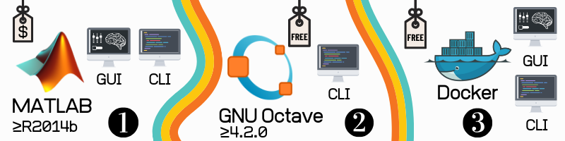

How to install
===============================================================================

qMRLab in MATLAB
~~~~~~~~~~~~~~~~~~~~~~~~~~~~~~~~
* Minimum required version: `R2014b`
* Required MATLAB products:
	* Image Processing Toolbox
	* Optimization Toolbox
* Available interfaces: 
	* Graphical User interface (GUI) 🖥
	* Command Line Interface (CLI) ⌨️

If you have a MATLAB license, you can easily start using qMRLab:

1. Download the latest stable release `here <https://github.com/qMRLab/qMRLab/releases>`_.
	* Scroll down to the page, download links are under the `Assets` tab.
2. Extract the downloaded `.zip` or `.tar.gz` file to a directory of your choice.
3. Open MATLAB point your current directory to the `qMRLab` folder.
4. Ensure that you can see `qMRLab.m` in the list of files of your current directory.
5. Execute the following command in your `Command Window` to initialize qMRLab's default environment::

    startup

6.1. If you would like to use **GUI**, execute the following command in your `Command Window`::

    qMRLab

* To see the beginners guide for **GUI** please refer to :ref:`Beginners example with GUI`

6.2. If you would like to use **CLI**, ensure that the environment is ready to use by executing the following command in your `Command Window`::

    qMRLabVer

* To see the beginners guide to **CLI** please refer to :ref:`Beginners example with batch`

qMRLab in Octave
~~~~~~~~~~~~~~~~~~~~~~~~~~~~~~~~
* Minimum required version: `4.2.0`
* Available interfaces: 
	* Command Line Interface (CLI) ⌨️
* If you don't have Octave installed, you can find the instructions `here <https://www.gnu.org/software/octave/>`_. 

GNU Octave is the free clone software for MATLAB. You can use nearly all the qMRLab methods in Octave via **CLI**: 

1. Download the latest stable release `here <https://github.com/qMRLab/qMRLab/releases/latest/download/qMRLab_latest.zip>`_.
	* Scroll down to the page, download links are under the `Assets` tab.
2. Extract the downloaded `.zip` or `.tar.gz` file to a directory of your choice.
3. To initialize qMRLab for **CLI** use in Octave, open your terminal::

    cd ../directory/where/you/extracted/qMRLab
    octave 
    startup 

* If you are running qMRLab in Octave for the first time, qMRLab will attempt to install the following packages (if not already installed): 
	* `struct`
	* `optim`
	* `io`
	* `statistics`
	* `image`

4. Ensure that qMRLab is ready to use by executing the following command in your `Command Window`::

    qMRLabVer

* To see the beginners guide to **CLI** please refer to :ref:`Beginners example with batch`

qMRLab in Docker 🐳
~~~~~~~~~~~~~~~~~~~~~~~~~~~~~~~~
Beginning from the release `v2.3.0`, qMRLab offers different flavors of Docker images:

* 🖥 `qmrlab/mcrgui <https://hub.docker.com/repository/docker/qmrlab/mcrgui>`_
	* Use qMRLab **GUI** without MATLAB license! Instructions are available `elsewhere <https://hub.docker.com/repository/docker/qmrlab/mcrgui>`_.
* 📑 `qmrlab/octjn <https://hub.docker.com/repository/docker/qmrlab/octjn>`_
	* Use qMRLab in **Jupyter Notebooks**! This image comes with **SoS Kernel** and some cool visualization libraries in **Python**, allowing you to combine qMRI processing with qMRLab in Octave and interactive visualization, all in the same notebook. Instructions are available `elsewhere <https://hub.docker.com/repository/docker/qmrlab/octjn>`_.
* ⌨️ `qmrlab/minimal <https://hub.docker.com/repository/docker/qmrlab/minimal>`_
	* Barebones qMRLab in Octave (i.e `qmrlab/octjn` without `jupyter`). Instructions are available `elsewhere <https://hub.docker.com/repository/docker/qmrlab/minimal>`_.

Docker image tags are coherent with qMRLab release versions. For example, if you would like to get Docker image with qMRLab `v2.4.0` installed::

    docker pull qmrlab/octjn:v2.4.0

🚀 Docker images are built and published automatically by `qMRLab's Azure Release Pipelines <https://hub.docker.com/repository/docker/qmrlab/minimal>`_.

How to cite?
~~~~~~~~~~~~~~~~~~~~~~~~~~~~~~~~

If you use qMRLab in you work, please cite:

Cabana, J.-F., Gu, Y., Boudreau, M., Levesque, I. R., Atchia, Y., Sled, J. G., Narayanan, S., Arnold, D. L., Pike, G. B., Cohen-Adad, J., Duval, T., Vuong, M.-T. and Stikov, N. (2016), Quantitative magnetization transfer imaging made easy with qMTLab: Software for data simulation, analysis, and visualization. Concepts Magn. Reson.. doi: 10.1002/cmr.a.21357

Please also cite the reference for the particular module you are using (specified in each model's page).